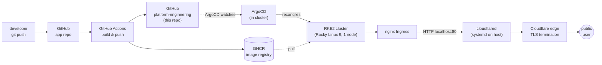

# platform-engineering

Personal platform engineering project covering the full delivery lifecycle: source code, continuous integration, container registry, GitOps deployment to a self-hosted Kubernetes cluster, and edge networking. Currently runs three production applications on a single-node RKE2 cluster.

| App | Live URL | Source |
|---|---|---|
| OT-edge asset tag generator | <https://getdfx.uk> | [`alexmchughdev/OT-edge-asset-tag-generator`](https://github.com/alexmchughdev/OT-edge-asset-tag-generator) |
| Personal site | <https://alexmchugh.dev> | [`alexmchughdev/alexmchugh-dev`](https://github.com/alexmchughdev/alexmchugh-dev) |
| FixMyCampus | <https://fixmycampus.alexmchugh.dev> | [`alexmchughdev/fixmycampus`](https://github.com/alexmchughdev/fixmycampus) + [`alexmchughdev/fixmycampus-infra`](https://github.com/alexmchughdev/fixmycampus-infra) |

## Architecture



Detailed walkthroughs and diagrams live in `docs/architecture.md`.

## Tech stack (currently in use)

| Layer | Component |
|---|---|
| Cluster | RKE2 v1.34.5 on Rocky Linux 9.7, single node |
| Container runtime | containerd 2.1.5 |
| Pod networking | rke2-canal (Calico + Flannel) |
| In-cluster DNS | rke2-coredns |
| Ingress | rke2-ingress-nginx 1.14.3 (bundled, runs in `kube-system`) |
| GitOps | ArgoCD (UI-registered Applications, no ApplicationSet) |
| Manifest layering | Kustomize (base + `overlays/production`) |
| CI | GitHub Actions |
| Image registry | GitHub Container Registry (GHCR), public images |
| Edge | Cloudflare Tunnel (`cloudflared` systemd unit on the host) |
| DNS | Cloudflare |
| Database (one app only) | MongoDB Atlas (managed, off-cluster) |

Confirmed via `kubectl get pods -A` and `helm list -A`. Anything not in the table above is not deployed.

## Apps

### OT-edge asset tag generator
Go microservice issuing UUID-based asset tags + QR codes for OT edge devices. Source: [`alexmchughdev/OT-edge-asset-tag-generator`](https://github.com/alexmchughdev/OT-edge-asset-tag-generator). Public URL: <https://getdfx.uk>. Reaches the cluster via Cloudflare Tunnel → NodePort 30092 (the only app still on a NodePort path; see `decisions/0003`).

### alexmchugh-dev
Personal website (Next.js, statically built and served by nginx). Source: [`alexmchughdev/alexmchugh-dev`](https://github.com/alexmchughdev/alexmchugh-dev). Public URL: <https://alexmchugh.dev>. Cloudflare Tunnel → nginx Ingress → frontend Service.

### FixMyCampus
React (Vite) + Express + MongoDB Atlas; campus maintenance reports. Application source is in [`alexmchughdev/fixmycampus`](https://github.com/alexmchughdev/fixmycampus); deployment infrastructure (Dockerfiles, build workflow, ArgoCD Application) is in a separate repo [`alexmchughdev/fixmycampus-infra`](https://github.com/alexmchughdev/fixmycampus-infra). Public URL: <https://fixmycampus.alexmchugh.dev>. nginx in the frontend pod reverse-proxies `/api/` to the backend Service so the SPA stays same-origin.

## Deployment patterns

The platform deliberately tolerates two patterns. See `decisions/0003` for the rationale.

### Pattern A — centralised manifests
Used by **OT-edge-asset-tag-generator** and **alexmchugh-dev**.

The application repo holds source, Dockerfile, and the CI workflow. The workflow builds an image, pushes to GHCR, then SSH-clones this manifest repo and runs `kustomize edit set image` against `apps/<app>/overlays/production/kustomization.yaml`. ArgoCD reconciles from this repo.

### Pattern B — split infra repo
Used by **FixMyCampus**.

The application repo holds only source code; no Dockerfile, no workflow. A second repo (`fixmycampus-infra`) holds the Dockerfiles, the build workflow, and the ArgoCD Application manifest. The infra workflow checks out app source via a read-only deploy key, builds, and updates this manifest repo. ArgoCD reconciles from this manifest repo (same as Pattern A).

This is technical debt — the variation arose from a constraint on the FixMyCampus source repo. Standardisation criteria are documented in `decisions/0003`.

## Repository layout

```
apps/
  ot-edge-asset-tag-generator/{base,overlays/production}/
  alexmchugh-dev/{base,overlays/production}/
  fixmycampus/{base,overlays/production}/
infrastructure/
  argocd/README.md            # what's running, install method, known issues
  ingress-nginx/README.md     # bundled with RKE2; not in this repo
  cloudflare-tunnel/README.md # systemd unit on host; config not committed
docs/
  architecture.md
  runbook.md
  diagrams/
decisions/
  0001-cloudflare-tunnel-over-cert-manager.md
  0002-gitops-with-argocd.md
  0003-deployment-pattern-variation.md
README.md
```

## Roadmap (planned, not yet implemented)

- Container image scanning (Trivy in CI).
- Static analysis (Semgrep in CI).
- Policy enforcement (Kyverno) for things like "no `:latest` tags in Deployments", "non-root containers", "resource limits set".
- Secret management with SealedSecrets or sops, replacing the current "apply secret out-of-band + annotate to skip ArgoCD" pattern.
- Observability stack: Prometheus + Grafana for metrics, Loki for logs, optionally Jaeger for tracing.
- Multi-environment overlays (`overlays/staging`, `overlays/production`) and a staging cluster.
- Standardise on a single deployment pattern across all apps once the criteria in `decisions/0003` are met.
- Replace the existing manual ArgoCD Application registration with an ApplicationSet that auto-discovers `apps/*/overlays/production/`. Blocked on a separate fix: the in-cluster `argocd-applicationset-controller` is currently in CrashLoopBackOff (see `infrastructure/argocd/README.md`).
- High-availability cloudflared (multiple replicas across hosts) once the cluster has more than one node.

Each item is a one-liner because none of them are partially done.
